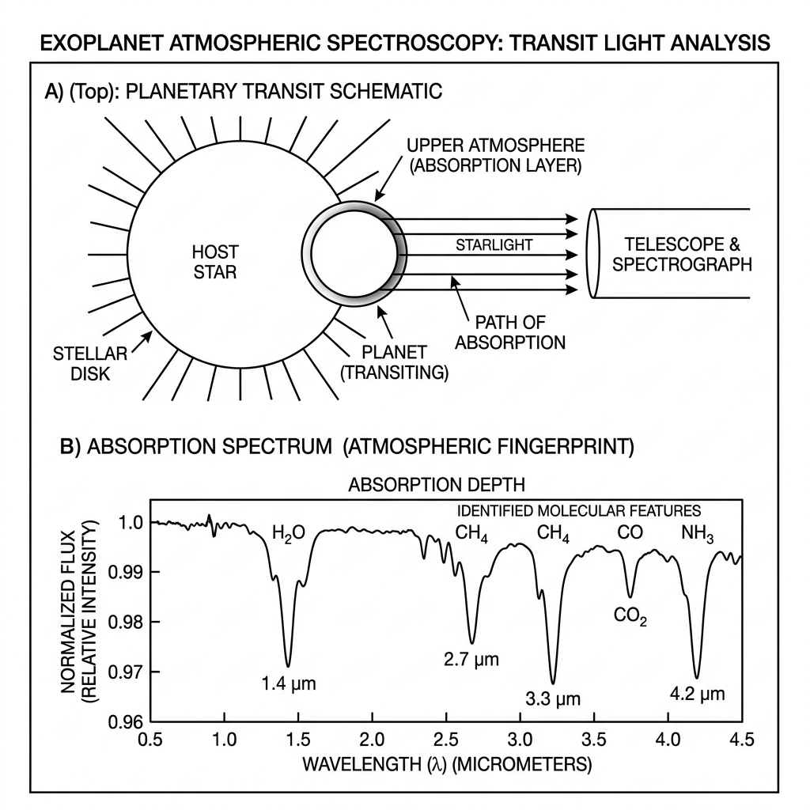
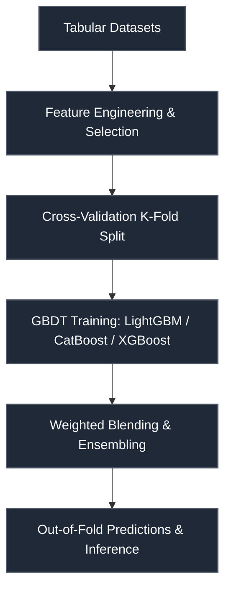

# Ariel Data Challenge 2025 — Atmospheric Spectra

 

> **Host:** [`ESA Ariel Mission`]  
> **Platform Link:** [Kaggle Competition](https://www.kaggle.com/competitions/ariel-data-challenge-2025)  
> **Dataset Link:** [Kaggle Dataset](https://www.kaggle.com/competitions/ariel-data-challenge-2025/data)  
> **Domain:** `Astrophysics & Signal Processing`

## Overview

This repository contains the developmental workspace and notebooks for the **Ariel Data Challenge 2025 — Atmospheric Spectra** project. The primary focus of this project is in the domain of **Astrophysics & Signal Processing** on ESA Ariel Mission. The codebase represents an iterative implementation of machine learning pipelines, structured to process datasets, train models, and validate predictions.

### Project Context

PLEAES READ BEFORE YOU PROCEED. 1. within the wall time.

### Technical Methodology & Implementation

The codebase features a total of 184 cells across 30 notebook(s). The system implements several key architectural elements:
- **Core Classes**: Custom object-oriented structures are defined to manage state and logic, including: `CatBoostTransitDepthModel`, `CatBoostWavelengthPredictor`, `Config`, `CrossCorrelationFusion`, `Discriminator`, `Discriminator_z`.
- **Key Algorithms & Utilities**: Procedural helpers and utilities facilitate operations, notably: `ADC_convert`, `__init__`, `_adaptive_weight_calculation`, `_adaptive_weighted_fusion`, `_advanced_detrending`, `_advanced_preprocessing`, `_align_signals`, `_apply_linear_corr`.
- **Training & Optimization**: Includes optimization via Adam, parallel multi-processing scheduling, cross-validation strategy for stable predictions.

## System Architecture

## Notebook Architecture

### Preprocessing & EDA

| Notebook / Script | Type | Versions | Average Size | Core Stack / Techniques |
| :--- | :--- | :--- | :--- | :--- |
| [EDA_and_Visualization](./Preprocessing%20%26%20EDA/EDA_and_Visualization.ipynb) | Single Notebook | v1 | 257 KB | Python |
| **EDA_and_Visualization_2** | Multi-Version Script | [v1](./Preprocessing%20%26%20EDA/EDA_and_Visualization_2/v1.ipynb), [v2](./Preprocessing%20%26%20EDA/EDA_and_Visualization_2/v2.ipynb) | 10 KB | Python |
| **EDA_and_Visualization_3** | Multi-Version Script | [v1](./Preprocessing%20%26%20EDA/EDA_and_Visualization_3/v1.ipynb), [v2](./Preprocessing%20%26%20EDA/EDA_and_Visualization_3/v2.ipynb), [v3](./Preprocessing%20%26%20EDA/EDA_and_Visualization_3/v3.ipynb) | 219 KB | Python |
| **EDA_and_Visualization_4** | Multi-Version Script | [v1](./Preprocessing%20%26%20EDA/EDA_and_Visualization_4/v1.ipynb), [v2](./Preprocessing%20%26%20EDA/EDA_and_Visualization_4/v2.ipynb), [v3](./Preprocessing%20%26%20EDA/EDA_and_Visualization_4/v3.ipynb) | 162 KB | Python |
| **LSTM_EDA_and_Visualization** | Multi-Version Script | [v1](./Preprocessing%20%26%20EDA/LSTM_EDA_and_Visualization/v1.ipynb), [v2](./Preprocessing%20%26%20EDA/LSTM_EDA_and_Visualization/v2.ipynb) | 169 KB | OpenCV, PyTorch, Python |

### Models & Utilities

| Notebook / Script | Type | Versions | Average Size | Core Stack / Techniques |
| :--- | :--- | :--- | :--- | :--- |
| **LSTM_Utility** | Multi-Version Script | [v1](./Models%20%26%20Utilities/LSTM_Utility/v1.ipynb), [v2](./Models%20%26%20Utilities/LSTM_Utility/v2.ipynb), [v3](./Models%20%26%20Utilities/LSTM_Utility/v3.ipynb), [v4](./Models%20%26%20Utilities/LSTM_Utility/v4.ipynb), [v5](./Models%20%26%20Utilities/LSTM_Utility/v5.ipynb) | 60 KB | OpenCV, PyTorch |

### Inference & Submission

| Notebook / Script | Type | Versions | Average Size | Core Stack / Techniques |
| :--- | :--- | :--- | :--- | :--- |
| **CatBoost_Inference** | Multi-Version Script | [v1](./Inference%20%26%20Submission/CatBoost_Inference/v1.ipynb), [v2](./Inference%20%26%20Submission/CatBoost_Inference/v2.ipynb), [v3](./Inference%20%26%20Submission/CatBoost_Inference/v3.ipynb), [v4](./Inference%20%26%20Submission/CatBoost_Inference/v4.ipynb) | 110 KB | CatBoost, PyTorch |
| [Inference](./Inference%20%26%20Submission/Inference.ipynb) | Single Notebook | v1 | 54 KB | PyTorch, Scikit-Learn |
| **Inference_2** | Multi-Version Script | [v1](./Inference%20%26%20Submission/Inference_2/v1.ipynb), [v2](./Inference%20%26%20Submission/Inference_2/v2.ipynb) | 115 KB | Scikit-Learn |
| **Inference_3** | Multi-Version Script | [v1](./Inference%20%26%20Submission/Inference_3/v1.ipynb), [v2](./Inference%20%26%20Submission/Inference_3/v2.ipynb), [v3](./Inference%20%26%20Submission/Inference_3/v3.ipynb), [v4](./Inference%20%26%20Submission/Inference_3/v4.ipynb) | 98 KB | Scikit-Learn |
| **LightGBM_LightGBM_CatBoost_Inference** | Multi-Version Script | [v1](./Inference%20%26%20Submission/LightGBM_LightGBM_CatBoost_Inference/v1.ipynb), [v2](./Inference%20%26%20Submission/LightGBM_LightGBM_CatBoost_Inference/v2.ipynb) | 100 KB | CatBoost, LightGBM, Scikit-Learn |
| [LightGBM_LightGBM_XGBoost_XGBoost_Inference](./Inference%20%26%20Submission/LightGBM_LightGBM_XGBoost_XGBoost_Inference.ipynb) | Single Notebook | v1 | 15 KB | LightGBM, Scikit-Learn, XGBoost |

## Navigation Guidelines

> **Stage Guidelines**
>
- **EDA & Preprocessing**: Verify data loaders and inspect class distributions before model design.
- **Training & Validation**: Check training runs, loss curves, and model validation scores to evaluate performance.
- **Inference & Ensembling**: Run predictions on testing files and verify submission formatting.

---

> "The oldest and strongest emotion of mankind is fear of the unknown deep space."
>
> — **Vigneshwaran S**
